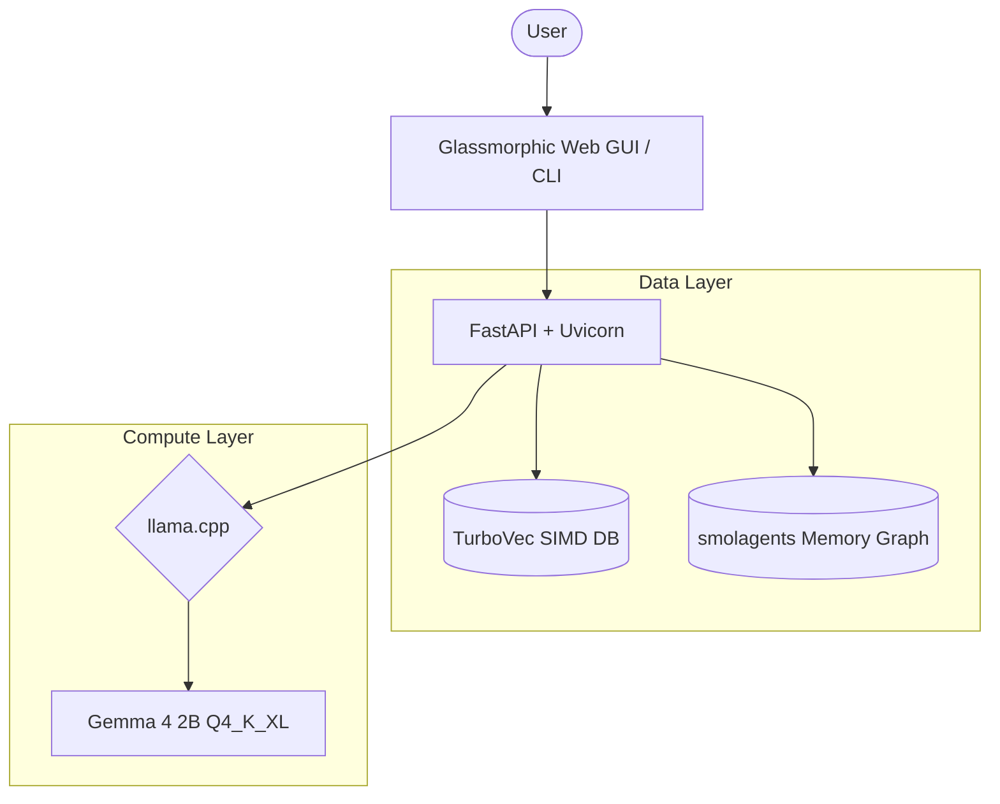

<div align="center">


# 🎓 VIORRA: Elite AI College Admissions Coach

[](https://github.com/qsardor/VIORRA)
[](https://huggingface.co/google/gemma-4-E2B-it)
[](https://huggingface.co/datasets/qsardor/viorra-admissions-essays)
[](LICENSE)

**VIORRA** is an open-source AI admissions coach built for students and educators to get Ivy-League level critiques on personal statements running 100% locally. 

Instead of superficial grammar checks, VIORRA uses **Gemma 4 (2B)** and a native SIMD vector database (**TurboVec**) to evaluate structural narrative, authenticity, and institutional fit. Your essays never leave your machine.

</div>

---

## ✨ Features & Updates (v1.1.0)

*   ⚡ **SIMD-Accelerated Local RAG:** Powered by native **TurboVec 4-bit quantized indexing** (replacing legacy FAISS). Features sub-millisecond retrieval latency (`~0.04 ms`) and a tiny RAM footprint (`~1.98 GB`), loading 615 Ivy League examples in under `115 ms`.
*   🌍 **Multi-Domain Admissions Support:** Pre-grounded in US Common App (650-word narrative), UK/UCAS (4,000-character academic), UCLA PIQ, and MBA Insead formats.
*   💬 **Interactive CLI Discussion:** Run `viorra --cli <file>` to generate a full admissions report and instantly transition into an interactive, conversational discussion with the AI coach.
*   🧠 **Autonomous Memory Graph:** Powered by background `smolagents` thread workers. It automatically saves personal facts, recurring weaknesses, and essay topics to your local knowledge graph, preventing context amnesia.
*   🚀 **High-Throughput Local Inference:** Powered by `llama.cpp` / `llama-cpp-python` with strict GPU-only enforcement (CUDA/Vulkan/Metal). Optimized context slicing limits history allocation to prevent VRAM overflow, outputting up to `~81.92 tokens/sec` on consumer GPUs.

---

## 📊 Real Performance Stats

Benchmarked live on a standard consumer laptop (NVIDIA RTX 4060 Laptop GPU):

<div align="center">

| Metric | llama.cpp + TurboVec Result |
| :--- | :---: |
| 🚀 Cold Boot Time (Model & VDB Load) | **~7.04 seconds** |
| 🔍 Query Embedding & Search (RAG Pipeline) | **~24.8 ms** (with `< 0.05 ms` native TurboVec index search) |
| ⚡ Inference Speed | **~81.92 Tokens/sec** |
| 🧠 RAM Footprint | **~1.98 GB** |
| 🎮 VRAM Footprint | **~3.5 GB** (during active generation) |

Run the benchmark yourself:
```bash
viorra --benchmark
```

</div>

---

## 🚀 Quick Start

### 1. The 60-Second Quick Start
Clone the repository, install the dependencies, and boot the web application in a single command:
```bash
git clone https://github.com/qsardor/VIORRA.git && cd VIORRA && pip install -e . && viorra
```

> [!NOTE]
> On the first startup, VIORRA natively pulls the 4-bit Q4_K_XL GGUF Gemma model and the pre-compiled RAG database (approx 2.5 GB) from Hugging Face. Subsequent boots load instantly from local cache.

---

## 🛠️ CLI Reference

For automated testing, scripting, and offline critiques:

```bash
# Analyze an essay file and enter interactive chat mode with the AI mentor
viorra --cli my_essay.txt

# Run a cold-boot hardware benchmark of the model and RAG pipeline
viorra --benchmark

# Verify system hardware compatibility and active GPU/VRAM layer offloads
viorra --status

# Clear all downloaded model caches (HuggingFace and FastEmbed)
viorra --clear-cache

# Delete all local user data and logs
viorra --factory-reset

# Force redownload of the latest RAG database and models
viorra --update

# Run a direct diagnostic test against the raw GGUF model (bypasses middleware)
viorra --test-raw

# Run the automated QA diagnostics suite
viorra debug
```

---

## 🏗️ Technical Architecture

<div align="center">



| Layer | Component | Description |
| :---: | :--- | :--- |
| 🧠 **Inference** | `llama.cpp` | Gemma 4 GGUF engine with strict GPU-only acceleration (Vulkan/CUDA/Metal) |
| 📚 **Context** | TurboVec (SIMD) | Native SIMD-quantized vector search database |
| ⚙️ **Backend** | FastAPI | Async ASGI server handling chat and background threads |
| 🖥️ **Frontend** | Vanilla SPA | HTML5 / CSS / JavaScript |
| 🤖 **Memory** | smolagents | Background knowledge graph compiler |
| ☁️ **Cloud Demo** | ZeroGPU + Gradio | Hugging Face Spaces deployment for public web access |

</div>

---

## 💻 System Requirements

> [!IMPORTANT]
> **GPU-Only Execution:** To guarantee sub-second admissions feedback, VIORRA runs strictly in GPU acceleration mode. CPU fallback execution is disabled in code.

| Component | Minimum Specification | Recommended Specification |
| :---: | :--- | :--- |
| 🎮 **Graphics (VRAM)** | **4 GB VRAM** (100% `llama.cpp` GPU offloading `n_gpu_layers=-1` via CUDA/Vulkan/Metal. VRAM footprint `~3.5 GB` during active inference) | **6 GB+ VRAM** (NVIDIA CUDA / Vulkan / Apple Metal) |
| 🧠 **System Memory (RAM)** | **8 GB RAM** (`~1.98 GB` active system footprint; CPU mode fallback is disabled) | **16 GB+** |
| 💿 **Storage Space** | **3.5 GB** of free disk space (Model: `gemma-4-E2B-it-qat-UD-Q4_K_XL.gguf`, Database: `viorra_index.tv`) | **SSD Storage** |
| ⚙️ **Processor (CPU)** | **x86_64 CPU with AVX2 support** (Required for TurboVec SIMD acceleration) | **AVX-512 compatible or Apple Silicon** |
| 🖥️ **Operating System** | Windows 10/11, macOS 12+ (Apple Silicon), or Linux (Ubuntu 20.04+) | Latest OS releases |

> [!TIP]
> **Windows CUDA 13.x vs Vulkan Compatibility:** Modern Windows host machines running NVIDIA Driver 610+ (CUDA 13.x) encounter severe stability regressions and VRAM memory leaks when compiling or running `llama.cpp` natively via CUDA. To achieve flawless GPU acceleration without system-level downgrades, the **Vulkan backend** for `llama-cpp-python` is used on Windows.

---

## 🔭 Project Roadmap (Current v1.1.0)

- [x] Native TurboVec 4-bit quantized SIMD RAG pipeline
- [x] Web GUI with glassmorphic styling and transitions
- [x] Conversational chat mode with thread memory
- [x] In-process background memory compiler (`smolagents`)
- [x] Interactive CLI discussion loop (`viorra --cli`)
- [x] Support for UK/UCAS and UCLA PIQ admissions essay formats
- [x] Cloud demo deployment on Hugging Face Spaces using ZeroGPU and Gradio

---

## 🔮 Known Limitations & Upcoming in v1.1.1

We are deeply aware of how Viorra's current base model behaves. While the native Gemma 4 (2B) model is powerful, its raw instruction-following behavior can sometimes lack the nuanced, empathetic tone required for elite admissions counseling. We know it needs dedicated fine-tuning to reach its ultimate potential.

**What we are actively building for v1.1.1:**
*   **Humanities Dataset Phase:** We are currently compiling a massive, specialized dataset (aiming for 1,000+ high-quality paired examples) containing deep reasoning traces from real admissions counselors.
*   **Unsloth QLoRA Fine-Tuning:** The upcoming version will feature a custom-trained model layer aligned specifically towards human empathy, qualitative feedback, and psychological reasoning.
*   **Multi-University Expansion:** Broadening feedback datasets to cover institution-specific quirks for 20+ top global universities.

---

## 👥 Team Violets

<div align="center">

| | Name | Role |
|:---:|:---|:---|
| 👑 | **Azizakhan Rustamova** | Founder |
| ⚙️ | **Sardor Qurbonov** | Lead Developer |
| 📈 | **Ruhshona Farhodova** | Business Developer |

</div>

---

<div align="center">


**Built with precision by Team Violets** · Engineered with [Google Antigravity](https://github.com/google-deepmind) AI Agent

[](https://huggingface.co/qsardor)
&nbsp;
[](https://github.com/qsardor/VIORRA)
&nbsp;
[](https://huggingface.co/spaces/qsardor/VIORRA)

</div>